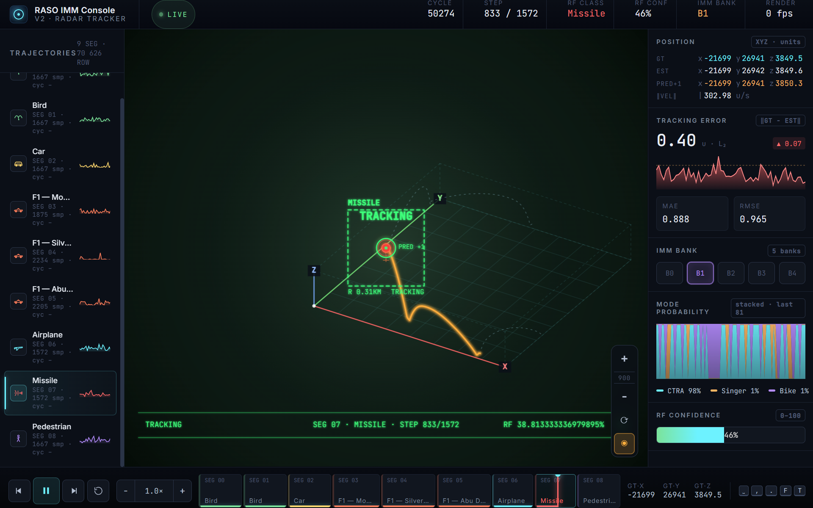

# Tracker — RASO IMM Mission Control

A real-time visualisation of an Interacting Multiple Model (IMM) radar
tracker, presented as an F-35-style cockpit HUD. Recorded tracking data
across nine trajectories — birds, cars, three Formula 1 laps (Monaco,
Silverstone, Abu Dhabi), an airplane, a missile, and a pedestrian — is
replayed step by step against the ground truth, with live error metrics,
model-probability evolution, and a fully procedural cockpit scene.

**Live:** https://widthmissmatch.github.io/Tracker/

## What it shows

The tracker fuses a bank of five motion models (B0–B4 — constant-turn
CTRA, Singer acceleration, bike/coordinated-turn, and two variants) and
estimates a target's position, velocity, and class from noisy radar
returns. The console exposes everything happening inside that loop:

- **Ground truth, estimate, and one-step prediction**, all in world
  coordinates, updated every cycle.
- **Tracking error** as live L2 norm, with rolling MAE, RMSE, a 95th
  percentile reference line, and a sparkline of the most recent window.
- **Mode probability** as a stacked area chart over time — you can watch
  the filter swing weight between CTRA, Singer, and bike models as the
  target manoeuvres.
- **Active IMM bank** highlighted across five model slots.
- **RF class** and **RF confidence** from the classification head, with
  the readout colour-coded per class.

## Engineering highlights

**Procedural cockpit scene, no game engine.** The 3D view is a custom
nadir projector drawn into a single 2D canvas — atmospheric sky
gradient, three parallaxed multi-octave mountain ridges, a ground plane
with perspective fall-off, and the tracked target rendered far below.
Over the top, a full HUD chrome is drawn frame by frame: pitch ladder,
bank/roll arc with tick pointer, heading tape with N/E/S/W cardinal
labels, altitude and airspeed tapes with floating readouts, flight path
marker, target lock box, prediction circle, and lock-state text
(tracking / locked / firing) gated by RF confidence.

**Camera that flies the trajectory.** Heading is derived from the
target's velocity vector and exponentially smoothed; bank angle is
auto-derived from heading rate, so the world banks into turns the way a
real aircraft would. The world is yaw-rotated so the velocity vector
always points "up" on screen, giving the operator a first-person feel
without ever leaving 2D.

**Live tweakable.** A `useTweaks` hook exposes fifteen runtime knobs
(altitude, FOV, horizon fraction, trail length, replay speed, lock mode,
plus toggles for terrain, mountains, clouds, HUD chrome, canopy, grid,
prediction marker) so the scene can be reshaped without rebuilding.

**Hand-drawn class iconography.** Every class — bird, car, F1, airplane,
missile, pedestrian, and the rest — has a custom monochrome SVG
silhouette that follows the active colour, used both in the trajectory
list and in the segment timeline at the bottom.

**Honest metrics.** The error panel computes MAE and RMSE from the same
rolling window the chart displays, the percentile line is recomputed
each frame, and the delta indicator shows signed change since the
previous cycle — no smoothing tricks that hide spikes.

## Data

A 5.7 MB JSON dataset of 16,126 timestamps across the nine trajectories.
Each sample carries the full IMM filter state — cycle index, segment id,
ground-truth position, estimate, velocity, one-step prediction, radar
class, active bank, confidence, and the three-way model probability —
all keyed to short field names so the file stays compact.

## Stack

React 18, vanilla canvas 2D, hand-rolled SVG. No build pipeline, no
bundler dependency in production, no third-party charting library. Inter
and JetBrains Mono are served as local woff2 subsets — the page makes
zero outbound network requests at runtime, so it works fully offline and
on slow links once cached.
