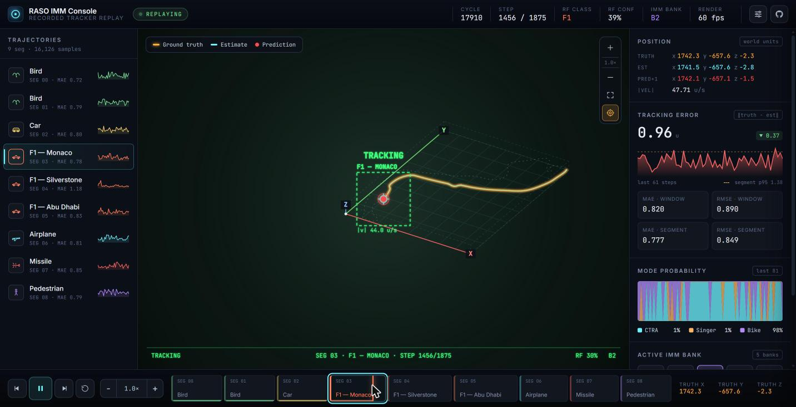

# Tracker — RASO IMM Console

A replay viewer for an Interacting Multiple Model (IMM) radar tracker.
Recorded filter output for nine trajectories — two birds, a car, three
Formula 1 laps (Monaco, Silverstone, Abu Dhabi), an airplane, a missile and
a pedestrian — is replayed step by step against the ground truth, with live
error metrics, mode probabilities and the RF classifier's output.

**Live:** https://widthmissmatch.github.io/Tracker/



> **Replay, not a live filter.** The tracker ran offline; this page plays
> back its stored output (`data/raso.json`). Nothing is estimated in the
> browser — positions are only interpolated between recorded samples so the
> motion looks smooth.

## What it shows

- **3D view** — the segment's bounding box, the ground-truth trail (amber),
  the filter estimate (cyan), the one-step prediction and the next few
  predictions (red), with a target box whose lock state follows RF
  confidence (lock ≥ 50 %, fire ≥ 80 %).
- **Tracking error** — ‖truth − estimate‖ over the last 60 steps with the
  segment's 95th-percentile line, plus MAE/RMSE for the window and for the
  whole segment.
- **Mode probability** — stacked CTRA / Singer / Bike weights over time.
- **Active IMM bank** (B0–B4) and the **RF class** with its confidence.

## Controls

| Key | Action |
| --- | --- |
| `Space` | Play / pause |
| `←` `→` | Step back / forward |
| `,` `.` | Previous / next segment |
| `1`–`9` | Jump to segment |
| `R` | Restart segment |
| `F` | Follow target |
| `+` `−` | Faster / slower |
| `[` `]` | Zoom out / in, `0` resets |
| `P` / `H` | Toggle prediction / HUD |
| `S` | Settings panel |

Clicking the active segment in the bottom timeline seeks within it. View
settings are remembered per browser.

## Project layout

```
data/raso.json            Source trace (16,126 samples, 9 segments)
scripts/build-data.mjs    Splits the trace into public/data/ (manifest + one file per segment)
src/
  data/                   Loading, class colours, metrics, formatting — no rendering
  render/                 Canvas drawing — pure functions, no React
    renderer.js           Draws one frame from (segment, rows, step, settings)
    scene.js / hud.js     World-space geometry / screen-space overlays
    projection.js         Fixed-angle 3D → 2D projector
  state/                  Playback clock, persisted settings, keyboard shortcuts
  components/             React UI: TopBar, TrajectoryList, Stage, Inspector,
                          Transport, SettingsPanel, charts/, icons/
  styles/                 Tokens + one stylesheet per area
public/fonts/             Self-hosted Inter and JetBrains Mono subsets
```

Data, state and rendering are separate layers: `render/` never imports React,
`data/` never draws, and components only wire the two together.

### Data format

`npm run data` writes `public/data/manifest.json` (segment labels, bounding
boxes, cycle ranges, error summaries) and `public/data/segments/seg-NN.json`.
Each row:

| Field | Meaning |
| --- | --- |
| `c` | Radar cycle index |
| `g` / `e` / `p` | Ground truth / filter estimate / one-step prediction `[x, y, z]` |
| `v` | Estimated velocity `[vx, vy, vz]` |
| `pr` | Mode probabilities `[CTRA, Singer, Bike]` |
| `ii` | Active IMM bank (0–4) |
| `rc`, `cf` | RF class index and confidence (0–100) |

To replay a different run, replace `data/raso.json` (same shape: `segs` +
`rows`) and rebuild.

## Development

```sh
npm install
npm run dev       # http://localhost:5173
npm run build     # static site in dist/
npm run preview   # serve dist/
```

## Deployment

`.github/workflows/deploy.yml` builds and publishes to GitHub Pages on every
push to `main` (Settings → Pages → Source: **GitHub Actions**).

## Stack

React 18 and Vite, vanilla canvas 2D, hand-written SVG charts and icons. No
charting library, and no requests to third-party hosts at runtime.
